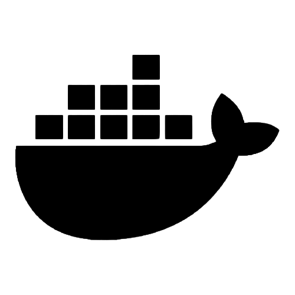

  <strong>about me</strong>

🎲 data engineer at [mobi7](https://www.mobi7.com.br/)/[localiza](https://www.localiza.com/)

✈️ former data engineer for [melhor envio](https://melhorenvio.com.br/)

⌨️ excited about coding and efficient ways to solve data dares

☁️ currently studying dataops, data infra as code and cloud/serverless data services

💬 ask me about anything [here](https://github.com/vitorschuh/vitorschuh/issues)

##

  <strong>skilled with</strong>

###

  
  
  
  

  
  
  

##

  <strong>interested in</strong>

###

  
  
  

